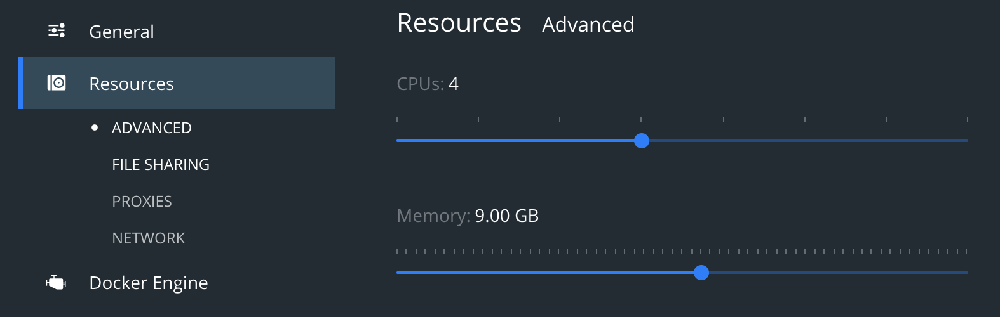

# TL;DR

  * Google's Open Source team announced [`criticality_score`](https://github.com/ossf/criticality_score/), which should capture the [_"influence and importance of a project"_](https://github.com/ossf/criticality_score/blob/4a3e3e171ac403344060dbcfc43f47944afe77d0/README.md) in an ecosystem.
  * The community disagreed if the signals of the current score appropriately identify _critical_ projects.
  * I suggest to rely on PageRank and Truck Factor per project as signals for computation of the `criticality_score`.
  * I demonstrate, that these two signals allow to identify _critical_ projects of an ecosystem, i.e., projects on which many other projects depend transitively and which are maintained mainly by single persons.
  * Examples for such _critical_ projects are [`six`](https://github.com/benjaminp/six) and [`idna`](https://github.com/kjd/idna) from PyPI, [`com.typesafe:config`](https://github.com/lightbend/config) from Maven, or [`tap`](https://github.com/tapjs/node-tap) from NPM.
  All of them have a truck factor of one and appear in the top 20 highest pageranks in their respective package manager's dependency graph. However, the current [`criticality-score`](https://github.com/ossf/criticality_score) for all of them is only around 0.5, which would indicate medium criticality.

# What is this?


This project was triggered by the [announcement](https://opensource.googleblog.com/2020/12/finding-critical-open-source-projects.html) of the [_criticality score_](https://github.com/ossf/criticality_score), which is a metric that the Open Source team at Google and Rob Pike envision to capture the [_"influence and importance of a project"_](https://github.com/ossf/criticality_score/blob/4a3e3e171ac403344060dbcfc43f47944afe77d0/README.md). More precisely, it is a number (`c`) `0 <= c <= 1`, where 0 means least-critical and 1 means most-critical. Currently, the criticality score is measured on Github repositories, but its intention is to measure the importance of a package in an ecosystem:

  > A package with higher criticality is one that is more important within its packaging system (NPM, RubyGems etc.) and therefore may deserve higher scrutiny and attention.
  >
  > Rob Pike [_"Quantifying Criticality"_](https://github.com/ossf/criticality_score/blob/a02c8311fbbbd5d569ebaad3106ec08532b3a10c/Quantifying_criticality_algorithm.pdf)

Pike describes a generic formula for computing criticality of a package as a normalized weighed sum of the ratio of the logarithm of signal[s (S<sub>i</sub>)], the logarithm of the maximum of signal value and a corresponding threshold T<sub>i</sub>:

https://raw.githubusercontent.com/ossf/criticality_score/main/images/formula.png

In [his paper](https://github.com/ossf/criticality_score/blob/a02c8311fbbbd5d569ebaad3106ec08532b3a10c/Quantifying_criticality_algorithm.pdf), Pike mentions as possible signals the number of package downloads or the number of its dependents. He does not provide any weights or thresholds. However, the [current implementation of the criticality score](https://github.com/ossf/criticality_score/blob/4a3e3e171ac403344060dbcfc43f47944afe77d0/criticality_score/run.py) relies on ten signals, such as, time since creation in months, time since latest update in months, average number of comments per issue over the last 90 days, etc. together with corresponding weights and thresholds.

The announcement of the project spawned discussions on [HackerNews](https://news.ycombinator.com/item?id=25381397), which spread to the project's [issue tracker](https://github.com/ossf/criticality_score/issues). 

The community criticized, that the proposed score in its current form, i.e., with current signals, weights, and thresholds, is [incorrect in that it ranked projects of low importance high but others that are foundational to many other projects low](https://news.ycombinator.com/item?id=25382682) or it was criticized that the suggested score favors [_popularity_ over for criticality](https://news.ycombinator.com/item?id=25385562).

Inspired by discussions on the [project's issue tracker](https://github.com/ossf/criticality_score/issues/8), on [HackerNews](https://news.ycombinator.com/item?id=25382712), by the Xkcd comic (below) that the project group linked in the official project announcement, the openness of the scoring formula to other signals, and by the fact that the project comes from Google -whose founders invented the [PageRank algorithm](https://research.google/pubs/pub334.pdf)-, I developed the hypothesis that computing criticality based on the signals PageRank and [truck factor](https://en.wikipedia.org/wiki/Bus_factor), it would be possible to identify _critical_ projects within an ecosystem more appropriately than the current formula can. 

Here _criticality_ means -exactly as in the comic below-, that many other important (foundational) packages depend on a critical project and that the amount of corresponding maintainers is low, potentially a single person. The PageRank should rank all packages in the dependency graphs of ecosystems' package managers and the truck factors per project should be _"the number of people on your team that have to be hit by a truck (or quit) before the project is in serious trouble"_ ([L. Williams and R. Kessler, Pair Programming Illuminated](https://books.google.dk/books?hl=da&lr=&id=LRQhdlrKNE8C&oi=fnd&pg=PR17&dq=Pair+Programming+Illuminated&ots=UZhdQBMPlm&sig=k4XHx3zxA9Eafc_hWguck3VfZoA&redir_esc=y#v=onepage&q=Pair%20Programming%20Illuminated&f=false)).


As discussed on HackerNews and on the issue tracker of the `criticality_score` project, it is hard to infer proper dependency information for many ecosystems. Therefore, to quickly investigate my hypothesis, I use the [libraries.io](https://libraries.io/data) [dataset ([DOI](https://doi.org/10.5281/zenodo.3626071). This dataset consists of a lot of projects from 37 package managers together with their dependencies of various versions.

In this project, I compute the PageRanks for all packages from 15 package managers, such as NPM, Maven, Pypi, Packagist, and Cargo, see [./analysis_conf.yml](./analysis_conf.yml)). For the moment, I compute the truck factor for the twenty projects with the highest PageRanks in each of these.

# Results

The results of computation of PageRanks and truck factors -incorporating the results of computing criticality with the current _criticality_score_- can be found in [./data/output/comparison.csv](./data/output/comparison.csv)). The top 1000 ranked projects per package manager can be found under [./data/output/](./data/output/)), where the file names are `<pkg_manager>_top_1000.csv`.

In the following some examples from the results:
<!-- 
## Python Projects from PyPI
 -->
On PyPI, there are in total 231690 packages of which 182498 (ca. 79%) have do neither depend on another package nor are dependent of another package, i.e., in- and out-degree of the package is equal to zero. Of the remaining 49192 packages, 17680 have either a direct dependency (only 424) or a transitive dependency ending on `idna`. That is, around a third (36%) of the packages that are connected in the dependency graph require either directly or indirectly the project `idna`. However, the `criticality_score` in its current configuration is only 0.41, whereas the pagerank of it is 109.91, which is the 14th highest in the PyPI dependency graph. Consequently, the `criticality_score` would suggest that the `idna` project is not particularly important. In reality it is, since -next to having so many projects depending on it- it is even discussed to [merge it into the standard library](https://github.com/kjd/idna/issues/67). `idna` is also _critical_ since it is mainly maintained by a single person. The project's truck factor is one. Even though there are currently 11 contributors, [Kim Davies](https://github.com/kjd) accounts for ca. 2/3 of all commits (67%) changing the absolute majority of code in the project.

<!--
117 / 174
Out[5]: 0.6724137931034483
-->
<!-- 
MATCH (n:Pypi) WITH n, size((n)<--()) as InDeg WITH n, size((n)--
  >()) as OutDeg WHERE InDeg = 0 AND OutDeg = 0 RETURN count(n)
182498


MATCH (n:Pypi) RETURN count(n)
231690
-->

[`core`](https://github.com/home-assistant/core) -an open source home automation project- is the project that is ranked most critical by the current `criticality_score` (0.873). Since it is not on PyPI, it is not in the libraries.io dataset and thereby not part of this analysis.
The current `criticality_score` ranks [`ansible`](https://github.com/ansible/ansible) as second (criticality score 0.871), whereas by pagerank it is ranked 330th (pagerank 2.7). With a truck factor of 22, I would think that `ansible` is not critical, since there are multiple persons maintaining it and since the pagerank suggests that it is important for parts of the Python community but it is not fundamental.


Similarly, in the Java realm, the most highly ranked project from the [`criticality_score` dataset](https://commondatastorage.googleapis.com/ossf-criticality-score/index.html) is `elasticsearch`. However, by pagerank it ranks 294 (pagerank 10.361) with a truck factor of 17. Consequently, I would argue that `elasticsearch` is not really a critical project even though it is important to parts of the community.


The results of this small experiment illustrate that:

  1. The projects with the highest pageranks are not those that are most highly ranked projects by the current `criticality_score`.
  1. Using pagerank one finds that many projects in the top 20 datasets for each platform are like the one in the comic above in that they have a low truck factor.


Note, likely one of the reasons, why the top 200 result lists of the current `criticality_score` are a bit skewed is, that they are computed based on what Github considers to be the most popular projects, i.e., it is based on star count. That explains, why for example the home automation tool `core` is at all in the list. Even though quite foundational, `idna` is not popular in terms of Github stars. It has only 131, whereas `core` has more than 38.3k stars.


# Limitations

This is a proof of concept, which relies on that the dependency information in the original dataset from libraries.io is correct. For example, the libraries.io dataset contains a multiple thousands of Go, Hackage, Julia, Nimble, etc. projects but no dependency information for these. That is, the code in this repository cannot compute a pagerank for these package managers. Supporting the people over there, for example with getting dependency information from other platforms, such as, Nix or other Linuxes - as [discussed on HackerNews](https://news.ycombinator.com/item?id=25381397)- would improve feasibility of running an experiment like that in a large scale scenario. (Also, it is not entirely clear how the libraries.io people precisely generate the dependency information.)

My computation of the truck factor might be a bit too pessimistic. That is, there might be more people actively maintaining a project compared to the computed score. On [truckfactor](https://github.com/HelgeCPH/truckfactor), I try to briefly describe how it is computed. There exist various truck factor algorithms, so one may replace mine with another one. Furthermore, computation of truck factors for repositories with multiple tens of thousands of commits is currently slow. That is the reason, why in [the results](./data/output/comparison.csv) there are currently only the top 20 projects of five package managers.


# Recreating the Experiment

## Requirements

  * Linux/Unix OS (tested on MacOS Mojave only)
  * Bash shell interpreter
  * The following shell tools need to be installed and available on the `$PATH`:
    - `wget`
    - `unzip`
    - `sed`
    - `tar`
    - `grep`
    - `xargs`
    - Docker needs to be installed and setup on your system, the `docker` command needs to be on `$PATH` an usable without `sudo`
    - `poetry` (and optionally `pyenv`) for dependency and virtual environment
  * 300GB of free disk space should be enough, but perhaps more are needed (I did not check the size of the DB store)
  * Internet connection
  * ...time... the entire process of dataset recreation takes some hours

The Python requirements can be installed like in the following:

```bash
$ poetry install
```

## Configuration

In case you are running Docker on MacOS instead of Linux, you have to increase the max amount of memory from the default 2GB:



## Run!

Running the following script recreates the dataset, computes the page rank for the dependency graph, and computes the truck factors for the top 20 of five package managers:

```bash
$ poetry shell 
(critical-projects-kuSPJuld-py3.9) bash-3.2$ ./create_db.sh
```

The script does the following:

  * Download the original dataset from libraries.io. Since it is 24GB in size, the download will take some time.
  * Unpack the dataset into a local directory `./data/input` The script will check that 184GB of disk space are available. If not it will stop.
  * Convert the data so that it can be imported to Neo4j.
  * Setup the GraphDB Neo4j in a Docker container.
  * Import the dependency graph to Neo4j.
  * Compute the pagerank for the selected package managers.
  * Compute the truck factors for the top 20 projects (highest pagerank nodes) from the package managers Cargo (Rust), Maven (Java), NPM (JavaScript), Packagist (PHP), and Pypi (Python). These five are the ones for which the libraries.io dataset contains dependencies and which appear in the `critical_score` dataset.


In case you want to experiment with the dependency graph in the database, connect to [http://localhost:7474](http://localhost:7474) and login as `admin` with the password `password`.


Note, the Docker container will store the actual database on the host machine in the directory `./neo4j/data`, which will take multiple GB too. Remember to clean the data once you are done with your analysis.

--------

_"Includes data from Libraries.io, a project from Tidelift"_: [](https://doi.org/10.5281/zenodo.3626071)
